This little write-up is mostly about a cool new macOS feature called **shortcuts**.  Before I get there, I'll just mention briefly

#### Passwords:  length matters

For a given length and size of the character set, the number of possible passwords N is

N = size^{length}

N is linear in size and exponential in length.

If we allow 5 possible characters and a length of 3, there are 125 possible passwords.  Double the size of the character set and we have 10^3 = 1000.  Double the length and we have 5^6 = 15625.

So don't get me started about password character requirements.  They had some utility in the dark ages but have been useless for many years.  I even heard about a banking site that enforced a password length *limit* --- no more than 8 characters.  Do not trust a site that still runs security software from the 1980s.

Ideally, passwords should be long (say, 24 characters or more), random, and rotated frequently (balance the threat model against convenience).  So, they should be stored somewhere rather than remembered, and generated by machine.

#### Password Assistant

macOS does this with the Login Keychain.  Your fingerprint or login password unlocks a keychain of passwords which the Safari browser will paste into a password entry field.

If you have clicked on the password field and it's a new site or you want to change the password, notice the key icon.  Clicking that will bring up the Password Assistant:

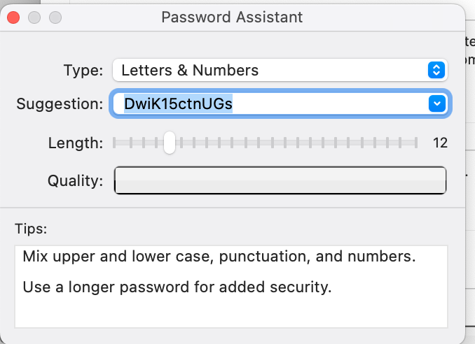

Several years ago, passwords could be generated with a dash after every four characters, which makes it really easy to type in a password on the rare occasions when that's necessary.  Unfortunately, a few websites *won't allow dashes in passwords*.  

This makes no sense, since the very first thing any website or application should do with a password is compute its hash (on the client) and then forget the password.

Another possible approach is from [xkcd](https://xkcd.com/936/)

```
> echo "correct horse battery staple" | md5 
88b5e2ade5a87faa8b0ccf4a42433b55
>
```

This has much to recommend it in the case where you don't want to write the password down, anywhere.  The search space is 2^128, which is a lot, and yet all you need is a simple passphrase, which you have *already* memorized.

If they'll allow it, use `sha256`

```
> echo "correct horse battery staple" | openssl sha256
73fe04e5a7a16dbe16492a8773036db1646d87e22337b1c64aae0afab788b626
>
```

256 bits is about 1 x 10^78 which is getting pretty close to the number of atoms in the universe.

#### How I generate passwords

Since I like Python, I wrote a tiny Python script which, minus a few implementation details, I run like this (in Terminal.app):

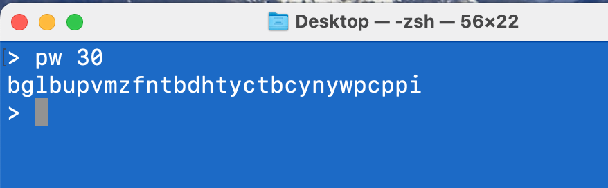

(This random password has 4 b's, 3 p's and 3 t's!  That's what random is!)

The script itself:

```
#! python3
import sys, secrets

N = int(sys.argv[1])
extended = len(sys.argv) > 2
    
s =  'abcdefghijklmnopqrstuvwxyz'
if extended:
    s += s.upper()
    s += '0123456789+/'

L = [secrets.choice(s) for i in range(N)]
pw = ''.join(L)
print(pw)
```

The details mainly involve what is needed so the zsh shell running in Terminal.app finds the script when you type `pw`.

#### Shortcuts.app

Over the years, macOS has had various methods for scripting, in addition to the usual Unix stuff.  I always found AppleScript unintuitive.  However, the coolest part about it is the ability to get info out of other applications.

Recently, they've added Shortcuts.app, which makes little programs whose name you can guess.  It's a bit confusing because we also have *keyboard* shortcuts.

Here's a new shortcut open for editing in the app.  It's very nice, a bit like the MIT language for kids called Scratch.

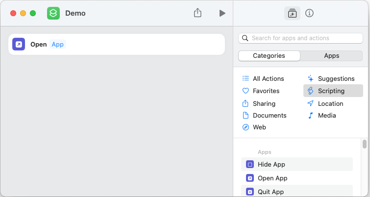

You drag various things called actions out from a palette, and then they are customizable.  Here I've dragged out "Open App" and I can edit the link to give the name of the app I want to open.

When your new shortcut is finished, you can do several things with it:

- *Pin* it in the Menu Bar
- Use as *Quick Action* in Finder or the Services menu

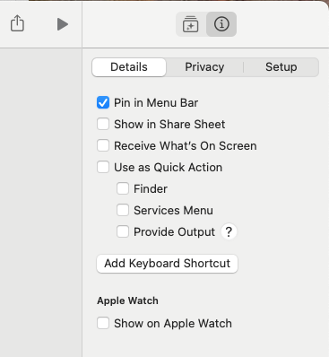

Choose which one to do by clicking the info tab of the palette, and then selecting the desired approach.

Menu bar (icon on the far left)
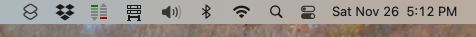

Finder

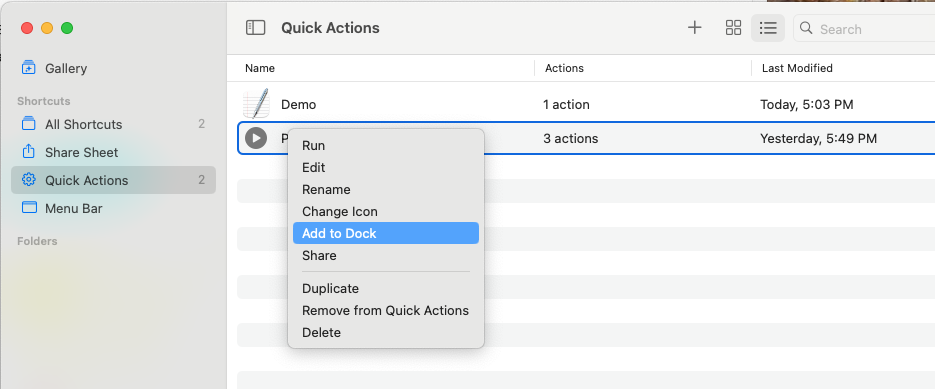

Option-click on the name in the list of shortcuts held by Shortcuts.app, and then choose Add to Dock.  Here it is in the Dock:

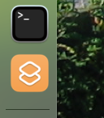

Less flashy but very convenient is to add it to the Services menu, where it can be easily available within any app.

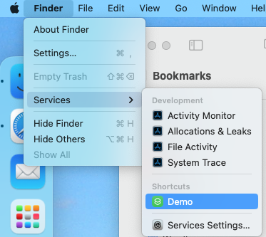

Shortcuts are also easily exported to another machine.  I didn't get the iCloud method to work but File > Export and then changing to "Anyone who Knows Me" allowed me to put it on the Desktop.

The icon can be customized as well.

#### Scripting in a shortcut

I want to run a Python script as a shortcut.  Here is an introductory example using just the zsh shell (no Python).  

We drag out
 
`Run Shell Script`
The default macOS shell is zsh.

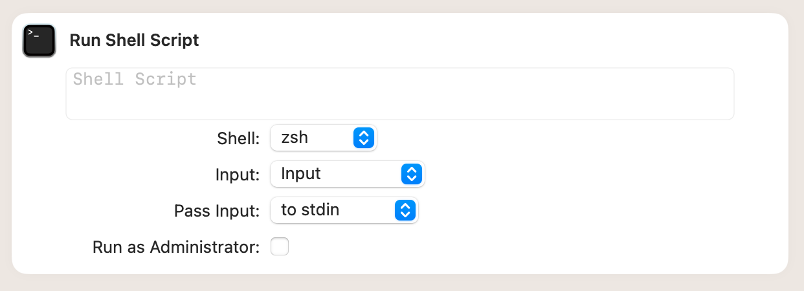

#### Modifying the shortcut to input arguments

Next, drag out a first section that does 

`Ask for Text with Length`

and has a default length of 25.

The script text is just `echo $1`.  

Input is `Provided Input` which has `Text` selected (expand the label).  Pass Input is `as arguments`.

Using `Provided Input` is the key to getting this to work.  It's not one of the 5 or 6 defaults and it was just changed to that automatically when I dragged out above the shell script.  Otherwise, I would never have known about that option.

The output is `25`, with the default input.

You will probably need to allow the shortcut access to the shell.  Do this in the Shortcuts.app under `Settings > Advanced`.

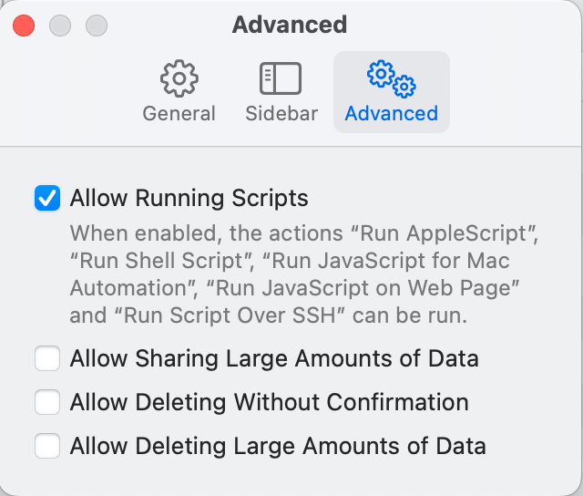

#### Python script

Next, switch to the Python3 shell, `/usr/bin/python3`.

Change the script text to

```
import sys
print(sys.argv)
```

Output:
['-c', '25']

So the first arg is weird, but the second is correct!

Change to my Homebrew Python:  `/usr/local/bin/python3`.  Still works.

Add an import of the `secrets` module.  Works.

Expand the script:

```
import sys, secrets
n = int(sys.argv[1])
c = 'abcdefghijklmnopqrstuvwxyz'
L = [secrets.choice(c) for i in range(n)]
print(''.join(L))
```

Works.

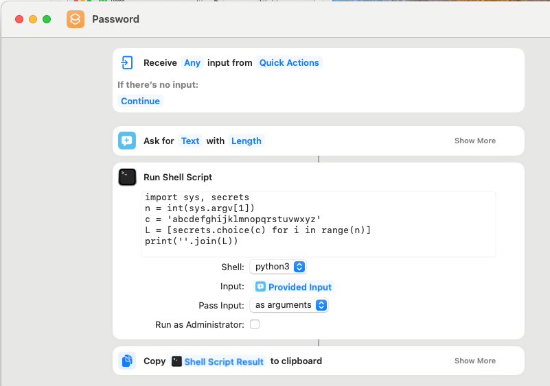

Add Copy to Clipboard which auto adjusts to `Copy Shell Script Result`.

Under Info > Details select the Quick Action > Services Menu.  Now it's available in any app, including Safari.  Paste shows we have a password on the Clipboard.

#### command line

```
> shortcuts run Passwords
> 
```

This doesn't give any output in Terminal.app, but it runs as usual.

#### current version

I wrote the following small script:

```
from secrets import choice as ch
R = range(5)
alpha =  'abcdefghijklmnopqrstuvwxyz'

def oneRound():
    return ''.join([ch(alpha) for i in R])
L = '-'.join(oneRound() for i in R)
```

It is in a file called `pw_helper.py`.  Inside the shortcut we provide the path to the helper and just `import` it.

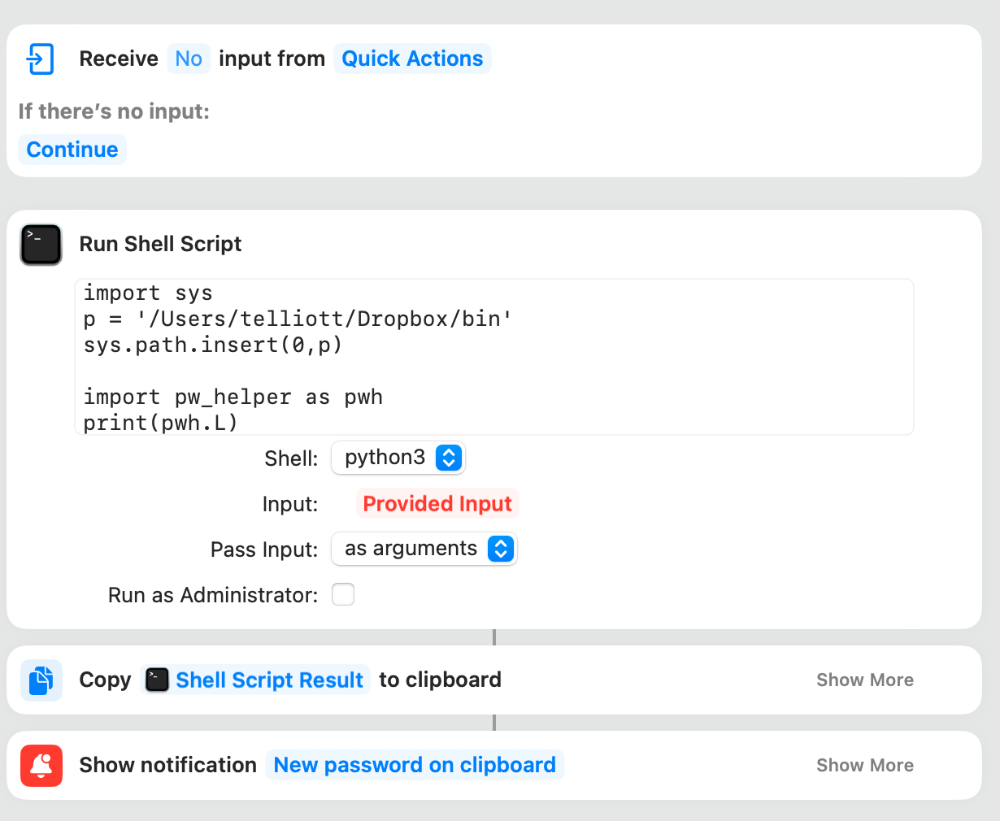

It works great!

#### Notification

I added an action called Show Notification with the text "New Password on Clipboard" and title "Shell Script Result".  

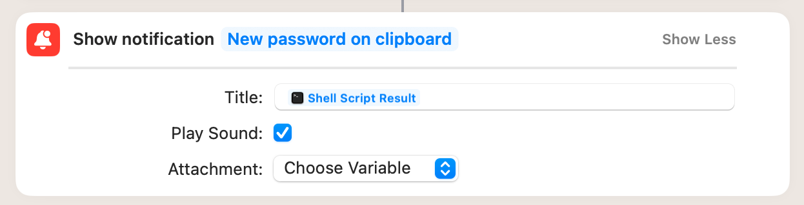

When I click on the shortcut's icon in the Dock, the menu bar looks like this:

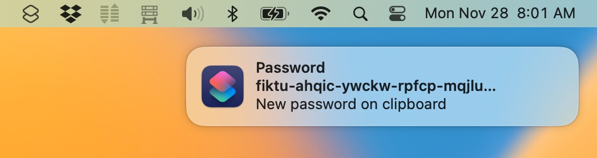
